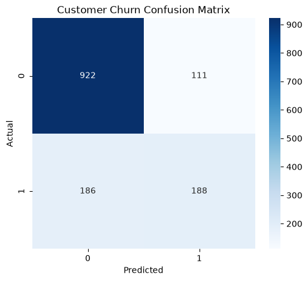
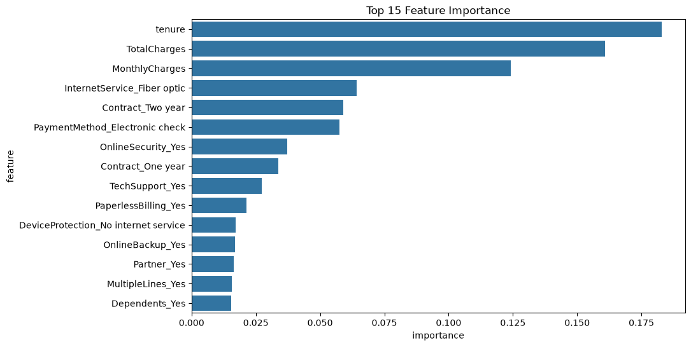

# MLflow Model Versioning and Monitoring Pipeline

A production-oriented machine learning lifecycle project demonstrating **experiment tracking, model versioning, model registry, evaluation, and model promotion using MLflow**.

This project uses a customer churn prediction problem to demonstrate how machine learning models can be managed beyond training — from experimentation to registered production-ready models.

---

# Project Overview

In real-world ML systems, training a model is only one part of the workflow.

A complete machine learning lifecycle requires:

- Tracking experiments
- Comparing multiple models
- Logging parameters and metrics
- Managing model versions
- Registering models
- Promoting approved models
- Evaluating deployed models

This project implements an end-to-end MLflow workflow for a customer churn prediction system.

---

# Key Features

## ML Experiment Tracking

Implemented using MLflow:

- Experiment creation
- Run tracking
- Parameter logging
- Metric logging
- Model artifact logging
- Run metadata tags


Tracked metrics:

- Accuracy
- Precision
- Recall
- F1 Score
- ROC-AUC


---

## Multiple Model Experimentation

The pipeline compares multiple machine learning algorithms:

| Model | Description |
|---|---|
| Random Forest | Ensemble tree-based classifier |
| Logistic Regression | Linear baseline model |
| Gradient Boosting | Boosting-based classifier |


Each model receives its own MLflow run.

Example:

```
Customer_Churn_Experiment

├── RandomForest_Baseline
├── LogisticRegression_Baseline
└── GradientBoosting_Baseline
```

---

# Model Registry

The best-performing model is automatically registered into MLflow Model Registry.

Example:

```
CustomerChurnModel

Version 1
Version 2
Version 3
```

Models can be promoted using MLflow aliases:

```
candidate

    |

champion
```

The production pipeline loads:

```
models:/CustomerChurnModel@champion
```

instead of depending on a fixed model version.

---

# Project Structure

```
mlflow-model-versioning/

│
├── src/
│   │
│   ├── preprocess.py
│   ├── train.py
│   ├── train_models.py
│   ├── evaluate.py
│   └── promote_model.py
│
│
├── data/
│   └── customer_churn.csv
│
│
├── artifacts/
│   │
│   ├── confusion_matrix.png
│   ├── feature_importance.png
│   └── classification_report.txt
│
│
├── logs/
│   │
│   ├── train.log
│   ├── train_models.log
│   └── evaluate.log
│
│
├── mlflow.db
│
├── mlruns/
│
├── requirements.txt
│
└── README.md
```

---

# Dataset

Dataset:

**Telco Customer Churn Dataset**

Source:

Kaggle Telco Customer Churn Dataset


Dataset characteristics:

- 7043 customer records
- 21 original features
- Binary target variable: Churn


Target distribution:

```
No Churn : 5174
Churn    : 1869
```

---

# Data Preprocessing

Implemented preprocessing steps:

## Remove unnecessary columns

```
customerID
```

removed because it does not provide predictive information.


## Convert numeric columns

```
TotalCharges
```

converted from object to numeric.


## Missing value handling

Rows containing invalid TotalCharges values were removed.


## Encoding

Categorical variables were converted using one-hot encoding.


Final dataset:

```
7032 samples

30 features
```

---

# Training Pipeline

Run:

```bash
python src/train_models.py
```

The pipeline:

1. Loads dataset
2. Performs preprocessing
3. Splits training/testing data
4. Trains multiple models
5. Logs experiments to MLflow
6. Selects best model based on F1 score
7. Registers the model

---

# MLflow UI

Start MLflow:

```bash
python -m mlflow ui
```

Open:

```
http://127.0.0.1:5000
```


MLflow tracks:

- Experiments
- Runs
- Parameters
- Metrics
- Models
- Registered versions

---

# Evaluation Pipeline

The evaluation script loads the registered production model:

```
models:/CustomerChurnModel@champion
```

and generates:

## Confusion Matrix




## Feature Importance




## Classification Report

Generated as:

```
classification_report.txt
```

---

# Model Promotion Workflow

Models follow a controlled lifecycle:


```
Training

   |

MLflow Registry

   |

Versioned Model

   |

candidate

   |

Validation

   |

champion

   |

Production
```


Promotion is managed using MLflow aliases.

---

# Installation

Create environment:

```bash
conda create -n mlflow_env python=3.10

conda activate mlflow_env
```


Install dependencies:

```bash
pip install -r requirements.txt
```

---

# Run Pipeline

## Train Models

```bash
python src/train_models.py
```


## Evaluate Champion Model

```bash
python src/evaluate.py
```


## Promote Model

```bash
python src/promote_model.py
```

---

# Example MLflow Results

Example tracked runs:

| Model | Accuracy | F1 Score |
|-|-|-|
| Random Forest | 0.7889 | 0.5587 |
| Logistic Regression | - | - |
| Gradient Boosting | - | - |


The highest-performing model is automatically registered.

---

# Technologies Used

## Machine Learning

- Python
- Scikit-learn
- Pandas
- NumPy


## MLOps

- MLflow
- MLflow Tracking
- MLflow Model Registry


## Visualization

- Matplotlib
- Seaborn


---

# Future Improvements

Possible extensions:

- Automated model validation gates
- CI/CD pipeline using GitHub Actions
- Docker deployment
- Data drift monitoring
- Model performance monitoring
- Cloud deployment
- Automated retraining pipeline


---

# Author

Sabitha Manoj

Machine Learning | Deep Learning | MLOps

GitHub:
https://github.com/sabithamanoj
